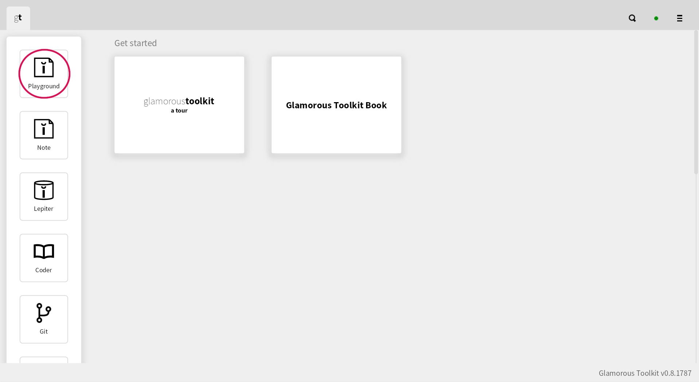
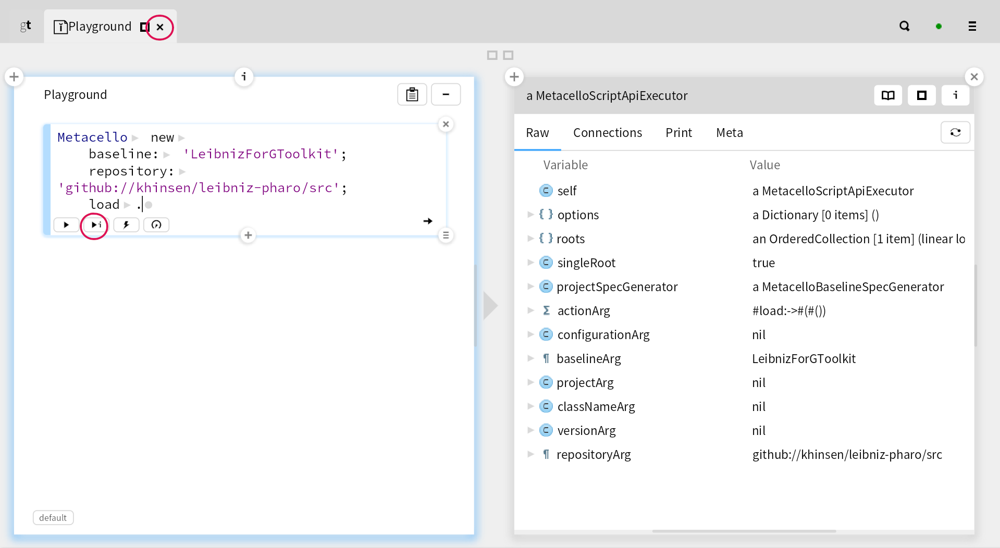
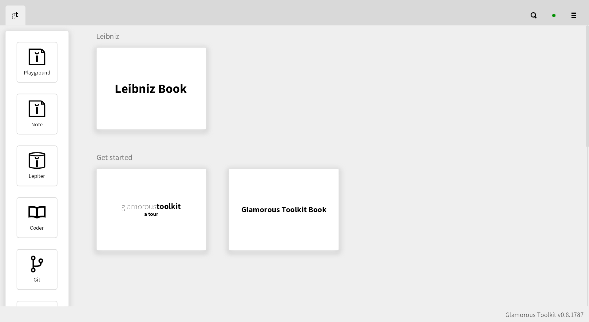
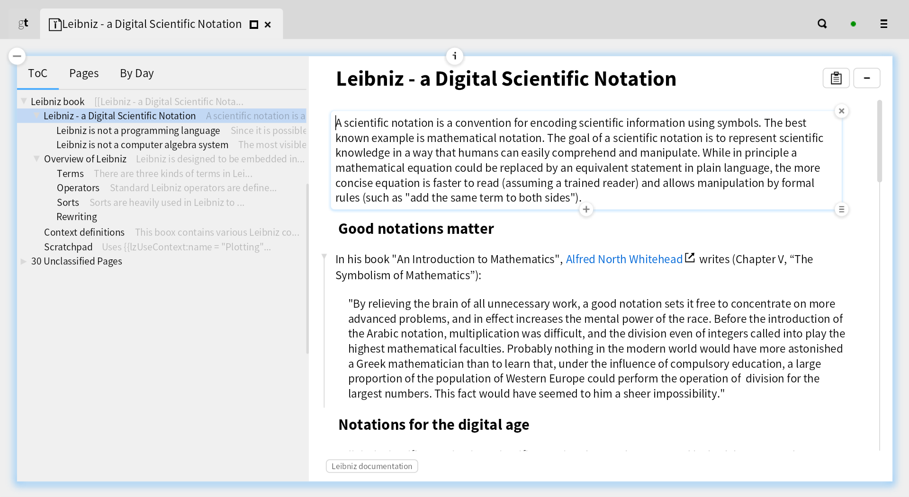

# leibniz-pharo

The second iteration of [Leibniz](http://github.com/khinsen/leibniz), implemented in [Pharo](http://www.pharo.org/) making heavy use of the [Glamorous Toolkit](https://gtoolkit.com/)


## Installation

### Install a font with all the math symbols

Leibniz makes generous use of Unicode glyphs that are not contained in the default fonts used by GToolkit. The best free code font (monospaced) I have found is [JuliaMono](https://juliamono.netlify.app/). For standard text fonts, the options I am aware of are [Arial Unicode MS](https://docs.microsoft.com/en-us/typography/font-list/arial-unicode-ms) and [Noto Sans Math](https://github.com/google/fonts/tree/main/ofl/notosansmath). Leibniz will automatically select one of them, if available. Otherwise it will use the default code font of Glamorous Toolkit. It lacks many of the maths symbols that Leibniz uses. Some of them will be substituted from other fonts if possible, making the text readable but often ugly. Others will be replaced by a default glyph, making the code unreadable.

### Install [Glamorous Toolkit](https://gtoolkit.com/)

The easiest option is downloading a ready-to-run binary for your system from [the download page](https://gtoolkit.com/download).

### Install Leibniz

1. Open Glamorous Toolkit and click on the playground icon near the top left.



2. Paste the following lines of code into the playground:
```
Metacello new
    baseline: 'LeibnizForGToolkit';
    repository: 'github://khinsen/leibniz-pharo/src';
    load.
```
Then click on the arrow highlighted in the screenshot below. Wait until the pane on the right appears. This may take a few minutes. Close the playground 
by clicking on the cross highlighted in the screenshot below.



3. Open the Leibniz Book

The installation process has added a big icon labelled "Leibniz Book" to the home screen of Glamorous Toolkit. Click on it to open it.



4. Start reading and exploring

Read the first page, and move on as you like, either following links or navigating through the table of contents.




## Dependencies

The following list is provided for information. All the dependencies will be installed automatically in the procedure explained above.

- [SingletonTrait](https://github.com/khinsen/singletontrait) is used for a few singleton classes.
- [RecursiveWriteBarrier](https://github.com//khinsen/RecursiveWriteBarrier) is used to make some objects fully immutable.
- [EqualityThroughVariablesTrait](https://github.com/khinsen/EqualityThroughVariablesTrait) is a trait that implements object equality in terms of equality of instance and indexed variables.
