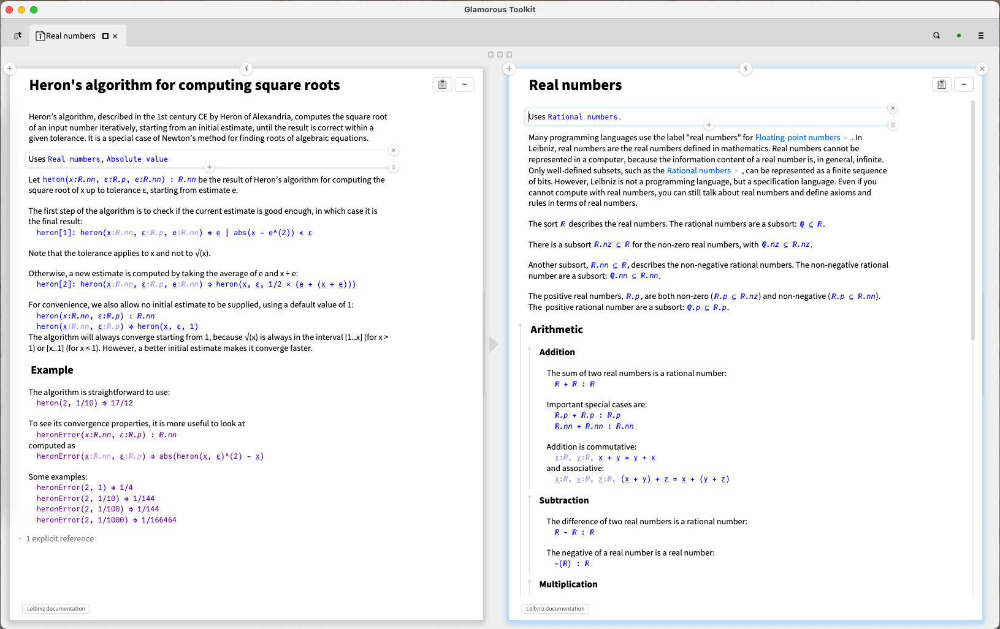

# leibniz-pharo

The second iteration of [Leibniz](http://github.com/khinsen/leibniz), implemented in [Pharo](http://www.pharo.org/) making heavy use of the [Glamorous Toolkit](https://gtoolkit.com/)




## Installation in a [pre-built GToolkit](https://gtoolkit.com/) distribution

Execute the following lines in a playground:
```
Metacello new
    baseline: 'LeibnizForGToolkit';
    repository: 'github://khinsen/leibniz-pharo/src';
    load.
```

Note that Leibniz makes generous use of Unicode glyphs that are not contained in the default fonts used by GToolkit. The only suitable free fonts I have found to replace them are [JuliaMono](https://juliamono.netlify.app/) and [Arial Unicode MS](https://docs.microsoft.com/en-us/typography/font-list/arial-unicode-ms). Leibniz will automatically select one of them, if available, for use in graphical displays.

If you want to correctly display these Unicode glyphs in Pharo code (in strings and symbols used by Leibniz), you have to replace the GToolkit default fonts by [JuliaMono](https://juliamono.netlify.app/) (or another suitable monospaced font). Run the following script from a playground:
```
TBlTextStyleable compile: 'glamorousCodeFont
    self fontName: ''JuliaMono'''.
TBlTextStyleable compile: 'glamorousCodeDefaultFont
    self defaultFontName: ''JuliaMono'''.
```

## Dependencies

The following list is provided for information. All the dependencies will be installed automatically in the procedure explained above.

- [XMLParser](https://github.com/pharo-contributions/XML-XMLParser/) is used to read Leibniz documents.
- [RecursiveWriteBarrier](https://github.com//khinsen/RecursiveWriteBarrier) is used to make some objects fully immutable.
- [EqualityThroughVariablesTrait](https://github.com/khinsen/EqualityThroughVariablesTrait) is a trait that implements object equality in terms of equality of instance and indexed variables.
